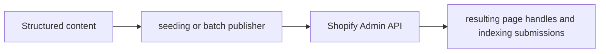

# Shopify Content Automation — Project Brief

## At a glance

| Field | Value |
|---|---|
| Portfolio area | Content operations |
| Repository | [jjshay/gauntlet-shopify-seed](https://github.com/jjshay/gauntlet-shopify-seed) |
| Status | Source available; runtime not revalidated in this documentation review |
| Evidence review | 2026-09-11; [commit ce2cbdd](https://github.com/jjshay/gauntlet-shopify-seed/tree/ce2cbddaedce9c1349fcbea46db8016090343011) |

## Problem and intended value

Store setup and editorial expansion repeat page, collection, and publishing operations.

The intended value is a repeatable workflow whose inputs, transformations, and outputs can be inspected. Use the evidence below to distinguish implementation from business outcomes.

## Architecture and data flow

Structured content → seeding or batch publisher → Shopify Admin API → resulting page handles and indexing submissions.

## Implementation evidence

| Source | Reading purpose |
|---|---|
| [seed.js](../seed.js) | Implementation component supporting the data flow described above. |
| [create_comparison_geo_posts.js](../create_comparison_geo_posts.js) | Implementation component supporting the data flow described above. |

The links above point to the current repository. The review reference identifies the version used to prepare this brief.

## Setup and operation

Use the existing [README](../README.md) for setup and operating commands. Configuration and dependency references: the source entry points and the existing README.

Start with sample or fixture inputs. Where external services are involved, configure a test account and check the distinction between a local preview, a generated artifact, and a remote write. Credentials and operational datasets are environment-specific.

## Validation and outcomes

**Review result:** Repository tree and referenced source reviewed. Existing application tests, hosted deployments, paid providers, and external mutations were not re-run in this documentation review.

No conventional test suite was identified in the reviewed repository tree; validation should begin with the next improvement below.

The source implements the workflow described above. No new revenue, accuracy, conversion, or production-uptime result is asserted by this documentation update.

Documentation itself is checked by `python3 scripts/check_project_docs.py`; that check validates this structure and its source references, not application behavior.

## Decisions and limitations

A reusable seed operation reduces manual work; each specialized publisher still needs its own duplicate and rollback behavior checked.

Keep provider-dependent observations dated and separate from deterministic transformations. State which assumptions a demonstration uses and which integrations it actually exercises.

## Interview talking points

- **Problem and product judgment:** Explain why this workflow mattered to its intended operator: Store setup and editorial expansion repeat page, collection, and publishing operations.
- **Technical walkthrough:** Trace one concrete input through this sequence: Structured content → seeding or batch publisher → Shopify Admin API → resulting page handles and indexing submissions.
- **Engineering tradeoff:** A reusable seed operation reduces manual work; each specialized publisher still needs its own duplicate and rollback behavior checked.
- **Evidence and ownership:** Open the source links above, identify the specific design or implementation decisions you personally drove, and distinguish AI-assisted implementation from measured operating results.
- **What comes next:** Document the larger local GEO84 workstream, and verify dry-run and rerun behavior before syncing additional publishers.

## Next improvements

Document the larger local GEO84 workstream, and verify dry-run and rerun behavior before syncing additional publishers.

Record any follow-up result with a date, exact command or evaluation method, input scope, observed output, and limitations. Update `project.json` alongside this brief.

## Related projects

- [AI Radar Services](https://github.com/jjshay/ai-radar-backend) — Content operations.
- [AI Radar Discovery](https://github.com/jjshay/ai-radar-demo) — Content operations.
- [AI Pulse Mobile](https://github.com/jjshay/ai-radar-mobile) — Content operations.
- [Art Catalog Automation](https://github.com/jjshay/art-catalog-automation) — Content operations.
- [Editorial Publishing Engine](https://github.com/jjshay/gauntlet-blog-engine) — Content operations.

Some related repositories require authorized GitHub access.
